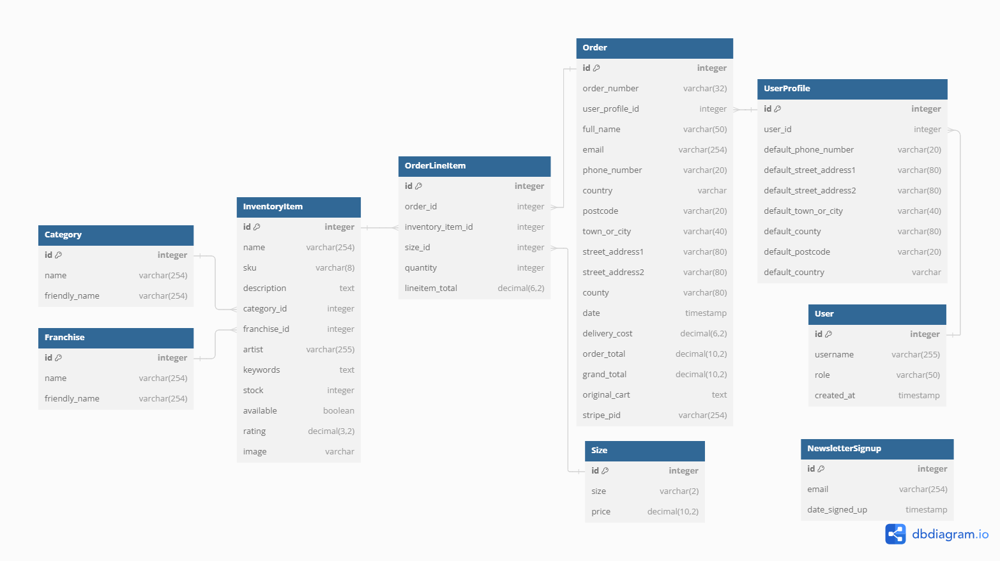
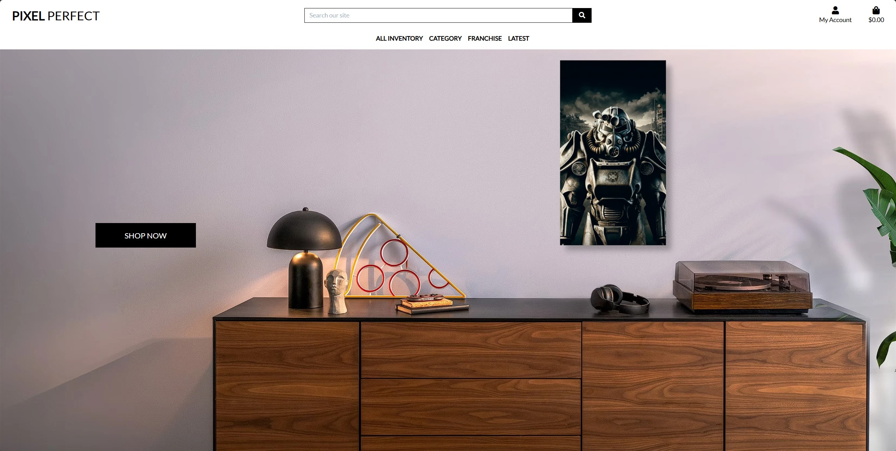
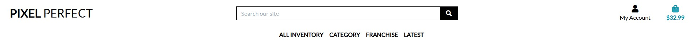
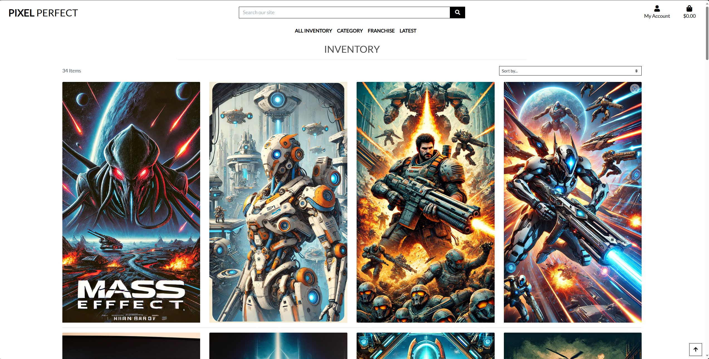
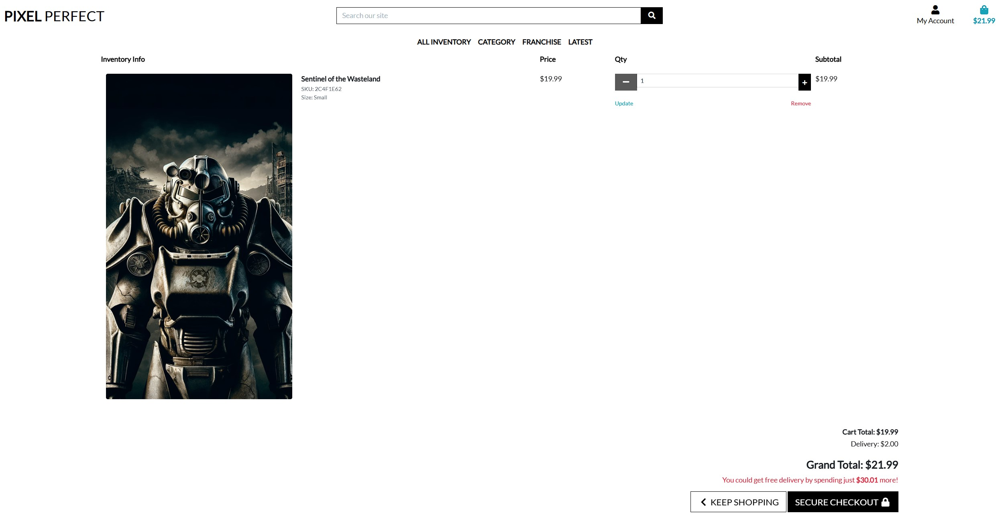
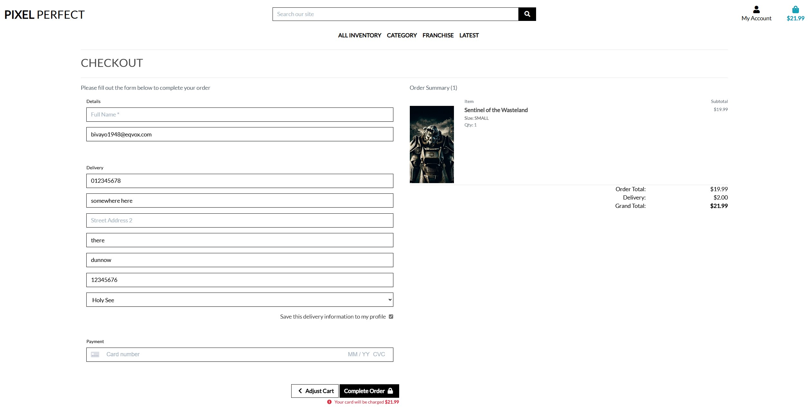
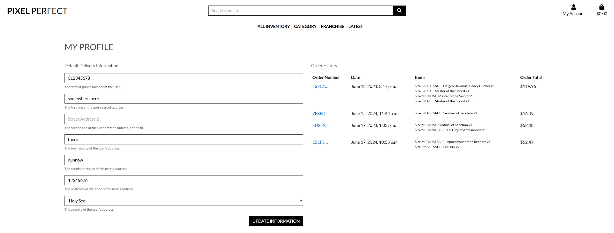
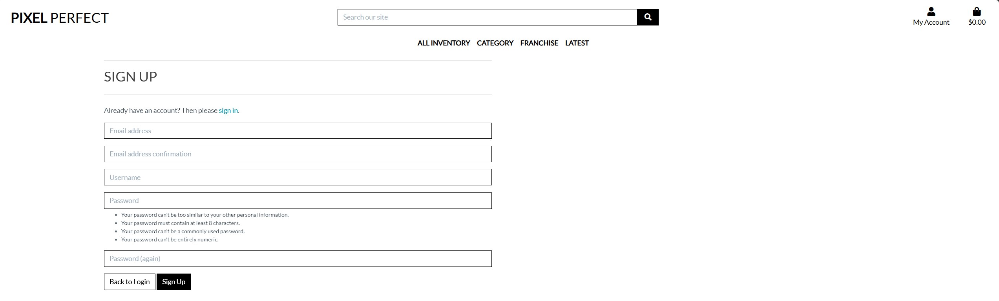
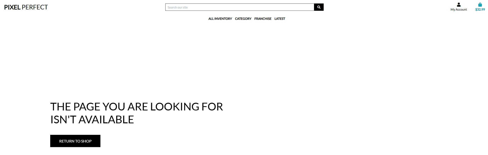

This is a migration from an old project that i am re using, i will be updated as the projects is worked on and ref to WatchBidCentral will be changed to PixelPerfect


todo features
must have
404 page - done
seo - done, althouth refor sitemap as still adding content
social media page
email thanking for signing up for newsletter - done


might have


wont have
with pillow when have 3 backgrounds that will overlay the poster onto when loading the product detail
carouseld of high rated and sale items
cookie popup
stock item reduced after sale confirmed
rating system so calculates new rating and writes it

main site for inspiration and images displate.com, email send to them on 27/05/24 requesting permission to use site assets

bugs

email setup, tutor assisted wtih solution downgradint runtime.txt, tried new app passwords, recheching variable names, 

inventory item overlay on background, initial thought i would be able to delivever this bu i proved to require more development time that i had, tried using Pillow to write new images to clouduinary on item creation. tried using css to manage the overlay loading on demand, but responsivenes requirements need more time to finish.

size costing implementation to link to inventory served to provide chanlenges to overcome, like fully udnerstanding the interactions of models and to a Many to many field.


# Pixel Perfect

Pixel Perfect is an exclusive digital haven tailored for the aficionados of game franchises, offering a marketplace that celebrates the art and craft of high-quality posters. This platform is not just a website; it's a dynamic community for both sellers and buyers to engage in the passionate exchange of exquisite game-themed artwork. From vintage classics to contemporary marvels, Pixel Perfect is dedicated to connecting art enthusiasts around the globe.

Here, users can craft listings for their cherished posters, purchase a diverse collection from esteemed artists, and immerse themselves in a realm where creativity meets fandom. Pixel Perfect prides itself on ensuring a secure, transparent, and straightforward experience, making it the premier destination for acquiring and distributing luxury posters.

Embracing the legacy and innovation of game art, Pixel Perfect is a confluence of history, artistry, and technology. It's a community where every design, print, and story behind the artwork matters, offering a unique space for enthusiasts to share, discover, and elevate their passion for game-inspired posters. Join the journey at Pixel Perfect, where every piece is a celebration of artistic expression and gaming culture.

<center> 

 

</center>

Developer: [Barry Flynn](https://github.com/barryCFlynn/) <br>
[Live webpage](https://pixel-perfect-d96b20ab326d.herokuapp.com/)<br>
[Project Repository](https://github.com/barryCFlynn/Pixel_Perfect)<br>

## Badges


---

## Table of Content

# Table of Contents

1. [Project Goals](#project-goals)
    - [User Goals](#user-goals)
    - [Site Owner Goals](#site-owner-goals)
2. [User Experience (UX)](#user-experience)
    - [Target Audience](#target-audience)
    - [User Requirements and Expectations](#user-requirements-and-expectations)
    - [User Stories](#user-stories)
3. [Database](#database)
    - [Database Schema Summary](#database-schema-summary)
4. [Design](#design)
    - [Color](#color)
5. [Technologies Used](#technologies-used)
    - [Languages](#languages)
    - [Frameworks](#frameworks)
    - [Tools](#tools)
    - [Supporting Libraries and Packages](#supporting-libraries-and-packages)
6. [Methodology](#methodology)
7. [Features](#features)
    - [Login Landing Page](#login-landing-page)
    - [About Us](#about-us)
    - [Create Listing](#create-listing)
    - [Liked Listings](#liked-listings)
    - [My Listings](#my-listings)
    - [Future Features](#future-features)
8. [Testing](#testing)
    - [Automated Testing](#automated-testing)
    - [Manual Testing](#manual-testing)
9. [Bugs](#bugs)
    - [Known Bugs](#known-bugs)
    - [Fixed Bugs](#fixed-bugs)
10. [Deployment](#deployment)
    - [App Deployment](#app-deployment)
    - [Version Control](#version-control)
11. [Credits](#credits)
    - [Django Documentation](#django-documentation)
    - [Bootstrap Docs](#bootstrap-docs)
    - [Media](#media)
    - [Content](#content)
12. [Acknowledgments](#acknowledgments)

---

# Project Goals
Pixel Perfect is a Django-based web application dedicated to game franchise enthusiasts and collectors, offering a sophisticated platform for the buying and selling of high-quality posters. The main goals of the project include:

1. Create a Secure and User-Friendly Marketplace: Develop a platform where users can list their game-themed posters for sale and purchase a diverse range of artwork in a safe and user-friendly environment.

2. Foster a Community of Enthusiasts: Build a community where poster and game art enthusiasts can share their passion, knowledge, and experiences related to various game franchises and artwork styles.

3. Implement a Transparent Verification Process: Ensure the authenticity and quality of posters listed on the platform through a clear and trustworthy verification process.

4. Enable a Seamless User Experience: Focus on providing a smooth and intuitive user experience from listing posters to making purchases, with an emphasis on high-quality images and detailed descriptions.

### User Goals
- Discover a Wide Selection of Game-Themed Posters: Explore an extensive collection of high-quality posters from reputable sellers and verified listings.
- Find a Specialized Platform: Utilize a platform that caters exclusively to the needs and interests of game franchise enthusiasts and art collectors.
- Safely Buy and Sell Posters: Engage in buying and selling posters within a secure community that values authenticity, quality, and the artistic elements of game franchises.
- Connect with Other Enthusiasts: Connect with fellow users to share insights, exchange knowledge, and discuss the historical and artistic significance of various game-themed artworks.

### Site Owner Goals
- Establish Pixel Perfect as a Premier Destination: Position Pixel Perfect as the leading online platform for buying and selling high-quality game-themed posters, recognized for its commitment to quality, authenticity, and community engagement.
- Create a Sustainable Business Model: Develop a business model that attracts a global audience of game art lovers and collectors, providing them with a reliable platform for their buying and selling needs.
- Continuously Improve the Platform: Enhance the platform based on user feedback and technological advancements, ensuring a state-of-the-art experience for all community members.

<p align="right">(<a href="#table-of-content">back to top</a>)</p>

---

# User Experience

### Target Audience
Pixel Perfect is tailored for the following target audience:

- Game franchise enthusiasts and collectors seeking a dedicated platform to buy and sell high-quality game-themed posters.
- Individuals interested in learning about game art and connecting with a community that shares their passion for high-quality game-themed artwork.
- Sellers looking for a trustworthy marketplace to list their game-themed posters and reach a global audience of potential buyers.
- Buyers in search of a secure and user-friendly environment to discover authentic, high-quality game-themed posters from reputable sellers.

### User Requirements and Expectations
When using Pixel Perfect, users can expect the following features and characteristics to fulfill their needs:

- A visually appealing and easy-to-navigate interface that enhances the experience of buying and selling game-themed posters.
- A secure registration and login process, safeguarding user data and transactions.
- Interactive features such as the ability to create listings, purchase posters, and engage with other users through comments and reviews.
- A personalized user profile where sellers can showcase their posters and buyers can manage their purchases and wishlists.
- Access to a curated selection of high-quality game-themed posters, with detailed information and images to ensure authenticity and quality.


### User Stories

User stories and tasks Grouped below.

- [As a Site Admin, I can create, edit, and delete advertisements - complete](https://github.com/barryCFlynn/WatchBidCentral/issues/1)


<br>

<p align="right">(<a href="#table-of-content">back to top</a>)</p>

---

# Database
When creating the database structure schema for this project, I utilized the [dbdiagram.io](https://dbdiagram.io/) website. This online tool allowed me to visually design and document the database schema, making it easier to plan and implement the database for the blog application.

<center> 

  

</center>

## Database Schema Summary

### `Category` Table
- Way to categorize posters, including flagging New Arrival.
- Fields: `name`, `friendly_name`.

### `Franchise` Table
- Way to categorize items under different franchises.
- Fields: `name`, `friendly_name`.

### `Inventory Item` Table
- Represents individual items available in the store.
- Fields: `name`, `sku`, `description`, `category_id > Category.id`, `franchise_id > Franchise.id`, `artist`, `keywords`, `stock`, `available`, `rating`, `image`.

### `Order Line Item` Table
- Represents each line item within an order.
- Fields: `order_id > Order.id`, `inventory_item_id > InventoryItem.id`, `size_id > Size.id`, `quantity`.

### `Order` Table
- Represents a customer's order.
- Fields: `order_number`, ` user_profile_id > UserProfile.id`, `contact_details`, `delivery_cost`, `order_total`, `order_total`,`stripe_pid`.

### `Size` Table
- Represents different sizes available for items.
- Fields: `size`, `price`.

### `User Profile` Table
- Stores additional information about a user.
- Fields: `user_id > User.id`, `contact_details`.

### `User` Table
- Represents a registered user of the system.
- Fields: `username`, `role`.

### `Newsletter Signup` Table
- Represents users who have signed up for newsletters.
- Fields: `email`.

This database schema outlines the structure for Pixel Perfect, enabling user engagement with art listings, personalization of user profiles, categorization of art by franchises, and secure payment options.

<br>

<p align="right">(<a href="#table-of-content">back to top</a>)</p>

---
# Features

### Using Keywords to Enhance Search Functionality
#### Overview
In our inventory system, each inventory item can have a set of keywords associated with it. These keywords play a crucial role in improving the searchability of items, allowing users to quickly find what they are looking for based on specific terms related to the product. Keywords can include various descriptors such as genre, style, color, theme, and other relevant attributes.

How It Works
Keyword Field in Inventory Item Model:
Each inventory item includes a keywords field where multiple keywords can be stored. These keywords are typically comma-separated strings that describe the item in various ways.

User Experience:
Users can enter terms related to their interests or needs into the search bar. The system will then look for these terms within the keywords, name, and description fields of inventory items, providing a comprehensive set of results that are more likely to match user expectations.

Benefits
Improved Search Accuracy: By leveraging keywords, the search functionality becomes more accurate and relevant, as it considers various aspects of an item beyond its name and description.
Enhanced User Experience: Users can find items more easily, making their interaction with the platform more enjoyable and efficient.
Flexible Categorization: Keywords allow for flexible and dynamic categorization of items, which can adapt to various search patterns and user preferences.
Example
For an inventory item representing a poster of a popular game franchise, keywords might include terms like "fantasy", "dragon", "RPG", and "adventure". This allows users searching for any of these terms to find the poster even if these terms are not explicitly mentioned in the item's name or description.

By integrating keywords into the search functionality, we enhance the discoverability of inventory items and provide users with a more powerful and intuitive search experience.

### Discount Notification Feature
#### Overview
The discount notification feature is designed to inform users when a product has sizes available at a discounted price. This feature ensures that customers are aware of any ongoing sales and can take advantage of the reduced prices.

Implementation Details
The feature works by checking if any of the available sizes for an inventory item includes the term "Sale." If a sale size is detected, a message indicating the discount is displayed on the product detail page.

How It Works
Inventory Detail View Update:
The view function inventory_detail is updated to include a check for sale sizes. It iterates through all the sizes of an inventory item and sets a flag (has_sale_size) if any size contains the term "Sale."

Template Update:
The template inventory_detail.html is updated to conditionally display a message if the has_sale_size flag is set. This informs users that a 25% discount is available on any size.

Benefits
Increased Awareness: Customers are immediately informed of any ongoing discounts, which can lead to increased sales.
User-Friendly: The notification is prominently displayed, ensuring that users do not miss out on any potential savings.
By incorporating this feature, the platform enhances user experience and promotes sales by clearly communicating discounts to potential buyers.

### Newsletter Signup Feature
#### Overview

The Newsletter Signup feature allows users to subscribe to our newsletter directly from the site. This feature ensures users stay updated with the latest news, updates, and special offers from Pixel Perfect. The signup form is easily accessible from the navigation menu under "My Account," making it convenient for both new and existing users to subscribe. It uses the built in email featrue of Django to send a custom email in templates/emails.

# Models

## Models Description

### Size Model
The `Size` model defines various size options for the posters, each with an associated price. This model allows for flexible pricing based on the size of the poster and is a Many to Many field.

- **Fields:**
  - `size`: A character field with choices for 'Small', 'Medium', and 'Large' etc.
  - `price`: A decimal field that stores the price for each size option.

### Product Model
The `Product` model represents individual posters in the inventory. This model includes comprehensive details about each product and utilizes a `ManyToManyField` to link to multiple `Size` entries. This setup enables each product to have various size and price options.

- **Fields:**
  - `title`: The name of the product.
  - `description`: A detailed description of the product.
  - `artist`: The name of the artist who created the poster.
  - `rating`: A decimal field to store product ratings.
  - `keywords`: A text field for comma-separated keywords to facilitate search functionality.
  - `category`: A foreign key linking to the `Category` model.
  - `franchise`: A foreign key linking to the `Franchise` model.
  - `sizes`: A many-to-many field linking to the `Size` model, allowing for multiple size and price options per product.
  - `stock`: The quantity of the product available in stock.
  - `available`: A boolean field indicating if the product is available for sale.
  - `created`: The timestamp when the product was created.
  - `updated`: The timestamp when the product was last updated.
  - `image`: An image field to store the product image.

This structure provides a robust framework for managing the inventory, supporting detailed product information, and flexible pricing based on size.

<br>

<p align="right">(<a href="#table-of-content">back to top</a>)</p>

---

# Design

The design of WatchBidCentral is meticulously crafted to resonate with the sophistication and elegance associated with luxury watches. The choice of colors, fonts, and layout are carefully selected to provide an upscale and professional feel, inviting users into a world of high-end watch collecting. The interface combines modern design principles with intuitive navigation, ensuring that both seasoned collectors and new enthusiasts can easily explore, bid, and list watches. The design aims to evoke trust and reliability, mirroring the quality and authenticity of the timepieces featured on the platform.

### Color

For colour the template I used "https://startbootstrap.com/template/shop-homepage" had a very simple colour scheme that I opted to not chnang:


Primary Background Colour

 

Secondary Background Colour


Contrast Grid - Only AA and AAA options used.

 


<p align="right">(<a href="#table-of-content">back to top</a>)</p>

---

# Technologies Used

### Languages
- HTML
- CSS
- Python
- JavaScript

### Frameworks
- **Django**: A high-level Python web framework that encourages rapid development and clean, pragmatic design, used for building the Culture Club web application.
- **Crispy Forms**: A Django package that simplifies form layout and styling, making forms more efficient and customizable.
- **Bootstrap v5.0**: The latest version of the popular CSS framework, used for creating responsive and visually appealing user interfaces.

### Database
- **ElephantSQL**: A cloud-hosted PostgreSQL database service, offering a reliable and scalable storage solution for the application's data.

### Media Management Platform
- **Cloudinary**: A cloud-based platform for media upload, storage, optimization, and delivery, used for managing images in the Culture Club project.

### Tools
- **Git**: A version control system for tracking changes in source code during software development.
- **GitHub**: A platform for hosting and managing Git repositories, enabling collaboration and version control for the project's codebase.
- **Gitpod**: A cloud-based IDE that provides a consistent and pre-configured development environment for the Culture Club project.
- **Heroku**: A cloud application platform used for deploying and hosting the Culture Club web application.
- **Adobe Photoshop**: A graphic design software used for editing and refining images for the website.
- **DB Diagram**: A tool for visualizing and creating database schemas, used for planning the database structure of Culture Club.
- **Google Fonts**: A library of free, open-source fonts, used to enhance typography on the website.
- **Font Awesome**: A library of icons and social logos, used for adding graphical elements to the Culture Club interface.
- **ChatGPT**: An AI to help troubleshoot issues.

### Supporting Libraries and Packages

- `asgiref==3.7.2`: foundational package for Django to support asynchronous web protocols like WebSockets.
- `cloudinary==1.36.0`: integration library for Cloudinary - cloud service for storing and managing media files and assets.
- `dj-database-url==0.5.0`: utility to help you configure your Django application's database from the DATABASE_URL environment variable.
- `dj3-cloudinary-storage==0.0.6`: Django storage backend for Cloudinary to handle media and static files.
- `Django==4.2.10`: Django web framework; the core framework for the web application.
- `django-allauth==0.57.2`: integrated set of Django applications addressing authentication, registration, account management, and third-party (social) account authentication.
- `django-crispy-forms==2.1`: Django app that provides a way to render Django forms in a DRY, configurable, and reusable way.
- `django-summernote==0.8.20.0`: Django app that integrates the Summernote WYSIWYG editor for text fields.
- `gunicorn==20.1.0`: Python WSGI HTTP Server for UNIX - robust and performant server to serve the Django application.
- `oauthlib==3.2.2`: generic, spec-compliant implementation of OAuth for use as a foundation for OAuth consumers and providers.
- `psycopg2==2.9.9`: PostgreSQL database adapter for Python, a prerequisite for using PostgreSQL with Django.
- `PyJWT==2.8.0`: Python library to encode and decode JSON Web Tokens (JWT), often used in authentication mechanisms.
- `python3-openid==3.2.0`: Python 3 port of the Python OpenID library, used for OpenID authentication.
- `PyJWT==2.8.0`: Python library that allows accurate and cross-platform timezone calculations.
- `requests-oauthlib==1.3.1`: An OAuthlib authentication support for Requests, which allows you to use OAuth to authenticate with APIs.
- `sqlparse==0.4.4`: non-validating SQL parser for Python, useful for parsing and splitting SQL statements.
- `urllib3==1.26.15`: powerful HTTP client for Python. Used by Requests internally.
- `whitenoise==5.3.0`: efficiently serves static files in Django applications, enhancing performance.

<p align="right">(<a href="#table-of-content">back to top</a>)</p>

---

# Methodology

The WatchBidCentral project adheres to an agile-inspired methodology, promoting teamwork, adaptability, and incremental development. This strategy has steered the project's progress:

### Agile Project Management with GitHub Projects
To streamline project management, GitHub Projects is employed as a central hub. User stories and tasks are structured as GitHub issues, creating an organized workflow. The GitHub project board serves as a visual representation, tracking progress effectively.

### User Stories as GitHub Issues
Transforming user stories into GitHub issues captures user-centric functionalities. These issues interlink with respective user stories, simplifying access to criteria, tasks, and comments.

<p align="right">(<a href="#table-of-content">back to top</a>)</p>

---

# The Site Pages
### Landing Page:
- Description: Main page with Hero image of a poster in a lounge environment, Nav Links to the rest of the site.
<center>

</center>

---

<details><summary>See Screenshot Mobile Main Page</summary>
<center>

</center>
</details>

---

### Nav Bar:
- Description: Navbar handles the Logo, search bar, links to inventory views, my Account and Cart. 
<center>

</center>

---

<details><summary>See Screenshot Mobile Nav Bar Page</summary>
<center>

</center>
</details>

---

### Inventory:
- Description: List of Inventory, can be filtered by the links for Category, Franchise and sorted numerous ways. 
<center>

</center>

---

<details><summary>See Screenshot Mobile Inventory Page</summary>
<center>

</center>
</details>

---

### Inventory Item:
- Description: Inventory Item view, here you can see details on the poster such as artist, description, keywords, select size, adjsut quantity and add to cart.
<center>

</center>

---

<details><summary>See Screenshot Mobile Inventory Item Page</summary>
<center>

</center>
</details>

---


### Cart:
- Description: Cart view, where you can view your selected items, update the quantity or remove them. There are buttons at the bottom of the page to continue to checkout or keep shopping.
<center>

</center>

---

<details><summary>See Screenshot Mobile Cart Page</summary>
<center>

</center>
</details>

---

### Orders:
- Description: Orders view, where you are able to enter delivery details (can be pre populated if logged in user), confirm the order details and submit card information, the payment scheme uses Stripe and will manage a number of circumstance with messages.
<center>

</center>

---

<details><summary>See Screenshot Mobile Orders Page</summary>
<center>

</center>
</details>

---

### Order Confirmation:
- Description: If the payment is successful the user will be taken to a order confirmation page to summarise their order. This can later be viewed again from the Profiles page.
<center>

</center>

---

<details><summary>See Screenshot Mobile Orders Page</summary>
<center>

</center>
</details>

---

### Profiles:
- Description: Accessing the Profile page from the My Account menu on the navbar you will be able to add or update Delivery information and see a list of your order hostory, clicking the order number will take you to the past order confirmation page and message to confirm.
<center>

</center>

---

<details><summary>See Screenshot Mobile Profile Page</summary>
<center>

</center>
</details>

---

### Order History:
- Description: From the Profiles page you can load any past order registered to your account, you will see a new message at the top right confirming that this is a past order. And you have a link back to profile.
<center>

</center>

### Register:
- Description: Accessing the Register page from the My Account menu on the navbar you will be able to create an account to log into the site. Aconfirmation email willl be send the the email addressed that must be followed to Verify.
<center>

</center>

### Sign In:
- Description: Accessing the Sign In page from the My Account menu on the navbar you will be able to log into the site, you will gain access to your profile and have your saved delivery information pre populate the Order form.
<center>

</center>

### Newsletter Sign up:
- Description: Accessing the Newsletter Sign up page from the My Account menu on the navbar you will be able to register yoru email to receive newsletters. You will receive an email stating you are registered. There are checks to prevent an email already in list from registering.
<center>

</center>

### Custom 404 page:
- Description: If a user enters an invalid URL they will be directed to a Custom 404 page informing them of the error and providing links to keep shopping.
<center>

</center>


## Features

| Feature                        | Description                                                                                  |
|------------------------------- |----------------------------------------------------------------------------------------------|
| User Authentication            | Secure sign-up, login, and logout functionality for users.                                   |
| User Profiles                  | Users can manage their profiles, including updating personal information and preferences.    |
| Inventory Listings               | Display a list of inventory items with images.                                   |
| Inventory Filterings               | Options on the Navbar links to filter by Price, Category, Franchise and New Arrivals.        |
| Inventory Sorting               | Options to sort by price, category, franchise, rating and name.                                   |
| Inventory Detail Page            | Detailed view of each inventory item, including images, descriptions, and pricing.           |
| Shopping Cart                  | Users can add items to their cart, update quantities, and remove items.                      |
| Checkout Process               | Secure checkout process, including payment integration with Stripe.                          |
| Order Management               | Users can view their order history and details of each order.                                |
| Admin Panel                    | Admins can manage products, orders, and user accounts.                                       |
| Newsletter Signup              | Users can sign up for a newsletter to receive updates and promotions.                        |
| Custom 404 Page                | Custom error page for when a user navigates to a non-existent page.                          |
| Sitemap and Robots.txt         | Sitemap for SEO and robots.txt to manage search engine indexing.                             |
| Responsive Design              | The website is fully responsive and works well on all device sizes.                          |


<br>

<p align="right">(<a href="#table-of-content">back to top</a>)</p>

---


# Testing
Testing was an integral part of the development process for Pixel Perfect, ensuring that the platform functions as intended and meets user requirements effectively. The testing process involves manual testing.

See testing documentation here

https://github.com/TerraBite147/echo-chamber/blob/main/testing.md


<p align="right">(<a href="#table-of-content">back to top</a>)</p>

---

# Bugs
The bug description section have been linked with the bug issues in my documentation for better visibility. The issue numbers are clickable to get a more comprehensive bug report.

### Known bugs ❌ 


<details>
<summary>Likes Button no longer working:</summary>

- Error

    
    
  At some point in Development it stoped working and ran out of time to fix it.

</details>


### Fixed bugs ✅


<p align="right">(<a href="#table-of-content">back to top</a>)</p>

---

# Deployment

### App Deployment
For deploying Your app, Heroku is used. Follow these steps:

 **Create a New App:**
   - Create a new app on Heroku dashboard.

 **Configure Settings:**
   - Navigate to "Settings" in new app.

 **Config Vars Setup:**
   - In "Config Vars," add `PORT` as the key and `8000` as its value.

 **Add PostgreSQL Database:**
   - Choose PostgreSQL as database.

        Example "ElephantSQL" was used in this project

 **Configure DATABASE_URL:**
   - In "Config Vars," add `DATABASE_URL` and copy the URL from PostgreSQL dashboard.

     Note: If using ElephantSQL as PostgreSQL provider, you can use the URL provided by ElephantSQL.

 **Environment Variable Setup:**
   - Create a new file in workspace called `env.py`.
   - Import the `os` library and set the environment variable for `DATABASE_URL` to the Heroku address (or ElephantSQL URL)
   - Add a secret key using `os.environ["SECRET_KEY"] = "your secret key here"`.

 **Heroku Config Vars:**
   - Add the secret key to the Heroku app's config vars in the settings.

 **Django Settings:**
   - In `settings.py` of Django app, import `Path` from `pathlib`, `os`, and `dj_database_url`.
   - Add `if os.path.isfile("env.py"): import env` to the file.
   - Replace the SECRET_KEY with `SECRET_KEY = os.environ.get('SECRET_KEY')`.
   - Replace the database section with `DATABASES = {'default': dj_database_url.parse(os.environ.get("DATABASE_URL"))}`.

 **Migrate Models:**
   - In workspace terminal, migrate the models to the new database connection.

### Cloudinary
To integrate Cloudinary into project, follow these steps:

 **Cloudinary Account:**
   - Log in to Cloudinary account or create one.

 **Copy CLOUDINARY_URL:**
   - Copy `CLOUDINARY_URL`.

 **Environment Variable Setup:**
   - In `env.py`, add `os.environ["CLOUDINARY_URL"] = "add cloudinary_url here"`.

 **Heroku Config Vars:**
   - In Heroku settings, add `CLOUDINARY_URL` to config vars.

 **Django Settings:**
   - In `INSTALLED_APPS`, add `cloudinary_storage`, `Django.contrib.staticfiles`, and `cloudinary` in this order.
   - Configure static file settings in `settings.py`: URL, storage path, directory path, root path, media URL, and default file storage.

 **Templates Directory Link:**
   - Link the file to the templates directory in Heroku with `TEMPLATES_DIR = os.path.join(BASE_DIR, 'templates')`.

 **Change Templates Directory:**
   - Change the templates directory to `TEMPLATES_DIR - 'DIRS': [TEMPLATES_DIR]`.

 **Additional Folders:**
   - Create three new folders: `media`, `static`, and `templates`.

 **Procfile Creation:**
   - Create a `Procfile`.
   - Add the following line inside the Procfile: `web: gunicorn project_name_here.wsgi`.

 **Push Changes:**
    - Push all changes to GitHub.

 **Manual Deployment:**
    - In the Heroku deployment tab, deploy to Heroku manually the first time and closely monitor the process.
    - Once successful, set up automatic deployments.

### Version Control
To manage version control and push code to the main repository on GitHub using GitPod, follow these steps:

 **Add Changes:**
   - In the GitPod terminal, use the command `git add .` to stage changes.

 **Commit Changes:**
   - Commit changes with a descriptive comment using the command:
     ```
     git commit -m "Push comment here"
     ```

 **Push to GitHub:**
   - Push the updates to the repository on GitHub with the command:
     ```
     git push
     ```

 **Migrate Models:**
    - In the terminal, migrate the models to the new database connection.


<p align="right">(<a href="#table-of-content">back to top</a>)</p>

---

# Credits
### Here's a collection of sites that were helpful in creating this website:

### Django Documentation:
The official Django documentation with guidance on models, forms, templates, and various aspects of Django development.

- [Models](https://docs.djangoproject.com/en/4.2/topics/db/models/)
- [DeleteView](https://docs.djangoproject.com/en/3.2/ref/class-based-views/generic-editing/)
generic-editing/)
- [Authentication System](https://docs.djangoproject.com/en/3.2/topics/auth/default/)
- [URL patterns](https://docs.djangoproject.com/en/5.0/topics/http/urls/)
- [Messages](https://docs.djangoproject.com/en/5.0/ref/contrib/messages/)
- [Automated testing](https://docs.djangoproject.com/en/5.0/topics/testing/overview/)

### Bootstrap docs:
- [Increase knowledge of Bootstrap framework](https://getbootstrap.com/docs/5.3/getting-started/introduction/)
- [Bootstrap Template used](https://startbootstrap.com/template/shop-homepage)

### Media

- All watch images were taken from a number of sites, too many to mention.

### Content
- Content for the webpage and readme-file was written together with [ChatGPT](https://chat.openai.com/)


<p align="right">(<a href="#table-of-content">back to top</a>)</p>

---

# Acknowledgments
 I'd like to give recognition to the ones who have supported me in creating this project:

My mentor Mitko Bachvarov for his help in guiding me through this project

<p align="right">(<a href="#table-of-content">back to top</a>)</p>

---