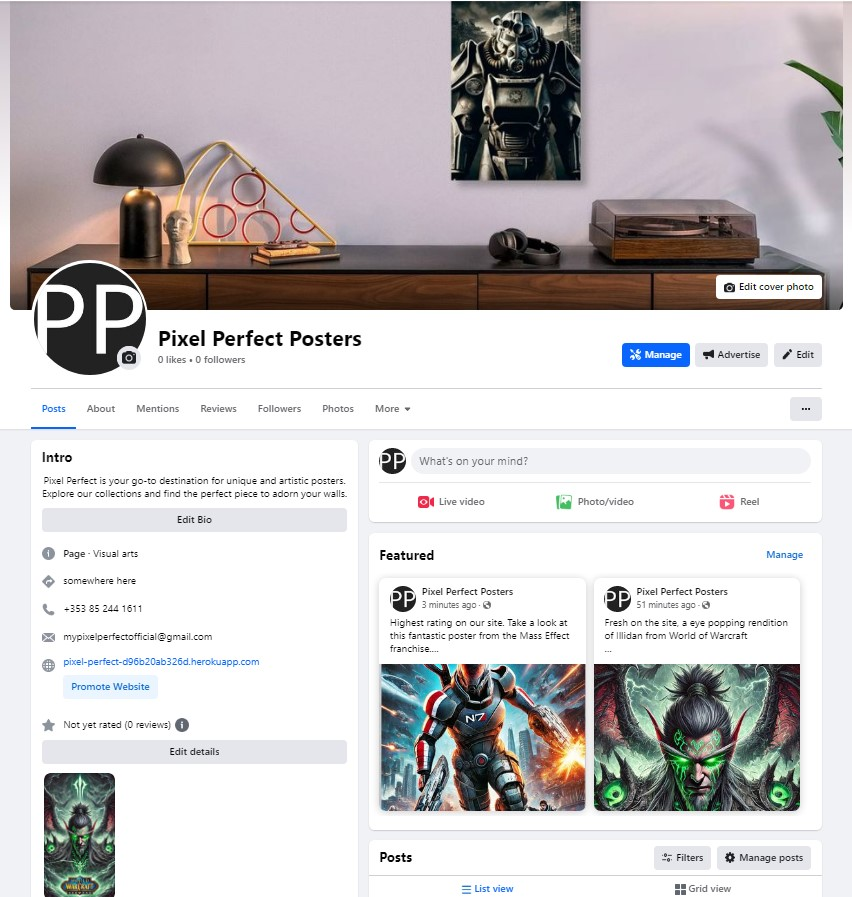
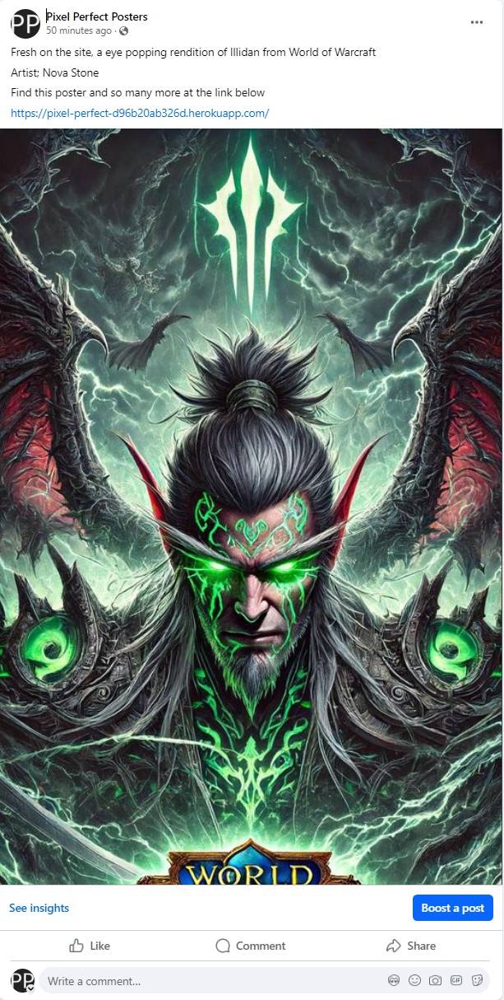
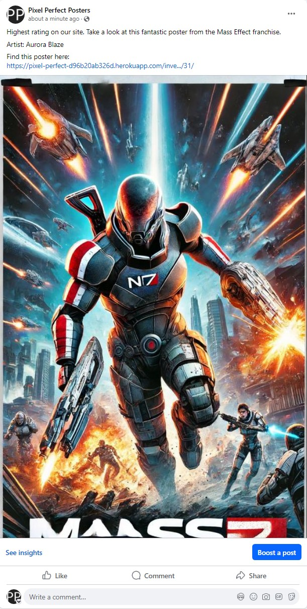
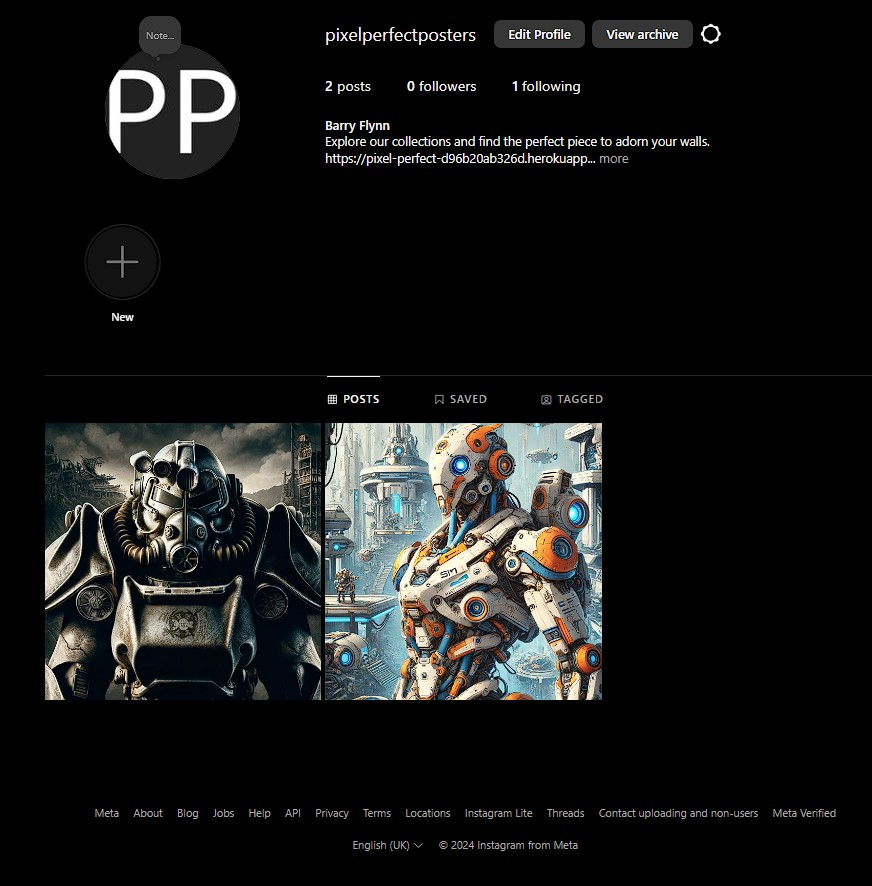

# Pixel Perfect Socials

 
 

[Developer Barry Flynn](https://github.com/barryCFlynn/)  
[Live webpage](https://pixel-perfect-d96b20ab326d.herokuapp.com/) 
[Project Repository](https://github.com/barryCFlynn/Pixel_Perfect) 

## Table of Contents

1. [Advertising on Facebook Pages](#advertising-on-facebook-pages)
2. [Advertising on Instagram](#advertising-on-instagram)
3. [Maximizing Your Advertising Impact with Facebook and Instagram Integration](#maximizing-your-advertising-impact-with-facebook-and-instagram-integration)

## Advertising on Facebook Pages

### Advantages of Advertising on Facebook Pages

Facebook offers advanced targeting options that allow businesses to reach specific audiences based on demographics, interests, and behaviors. This targeted approach ensures ads are seen by potential customers who are most likely to be interested in the products.

#### Key Advantages:

- **Cost-Effective**: Facebook advertising fits any budget with a range of ad formats and bidding options.
- **Engagement and Interaction**: Direct interaction through comments, likes, and shares fosters community and loyalty.
- **Analytics and Insights**: Robust analytics tools provide detailed performance insights.
- **Brand Awareness**: Increases visibility and awareness across a large and diverse audience.

### Main Page

- **Logo as Avatar**: Maintains brand consistency and enhances brand recall.
- **Landing Page Hero Image as Banner**: Sets visual tone and quality impression.

 
 

### Posts

1. **First Post**: Features a new arrival with artist mention and site link.

 
 

2. **Second Post**: Highlights a highly rated poster with artist mention and item link.

 
 

(<a href="#table-of-content">back to top</a>)

## Advertising on Instagram

### Advantages of Advertising on Instagram

Instagram's visually-driven platform is ideal for showcasing Pixel Perfect's vibrant posters to its billion active users.

#### Key Advantages:

- **High Engagement**: Visual content drives interaction and engagement.
- **Targeted Advertising**: Advanced targeting options ensure ads reach relevant audiences.
- **Visual Appeal**: Showcases artistic quality effectively.
- **Influencer Partnerships**: Collaborates with influencers for extended reach.
- **Shop Integration**: Enables direct purchases from posts.

 
 

### Posts

1. **First Post**: Features a product with a call to action in the bio.

 
 

2. **Second Post**: Highlights another product with a call to action in the bio.

 
 

(<a href="#table-of-content">back to top</a>)

## Maximizing Your Advertising Impact with Facebook and Instagram Integration

In the digital marketing landscape, integrating Facebook and Instagram advertising maximizes reach and engagement.

### The Power of Facebook and Instagram Integration

- **Unified Ad Management**: Meta's Ads Manager simplifies campaign management.
- **Extended Reach**: Combines audiences for broader visibility.
- **Cross-Platform Insights**: Analyzes demographic interactions for targeted strategies.
- **Cost Efficiency**: Optimizes ad spend for maximum return.

### Popular Strategies for Integrated Advertising

- **Consistent Visual Branding**: Maintains brand identity across platforms.
- **Tailored Content**: Adapts content to platform characteristics.
- **Utilize Stories and Reels**: Engages with short-form, visually appealing content.
- **Engaging CTAs**: Encourages specific user actions.
- **User-Generated Content**: Enhances authenticity and community.

### Conclusion

Integrated advertising on Facebook and Instagram enhances brand visibility and engagement, driving growth in digital marketing.

(<a href="#table-of-content">back to top</a>)

